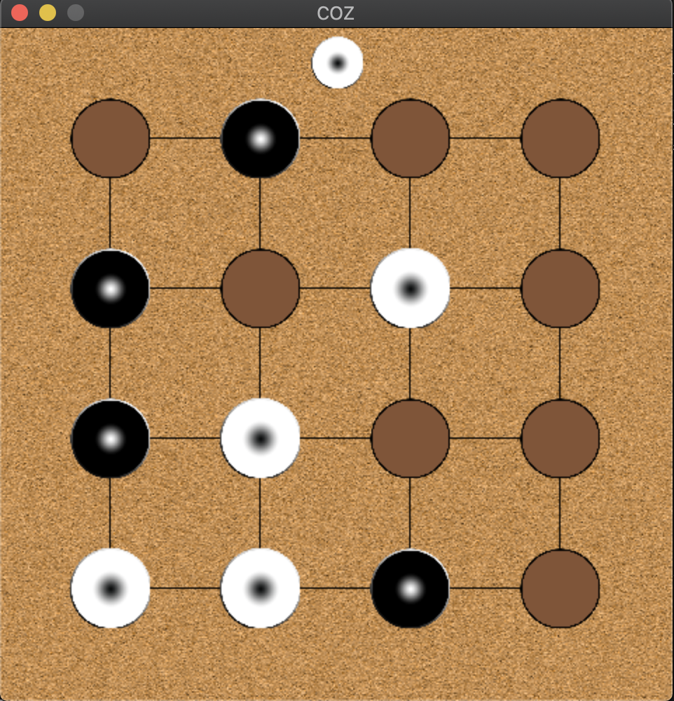

# CPPND: Capstone 

I decided to make a game called Coz for the Capstone Project. 
This game is played with 2 players.
In addition to traditional game, 2 more difficulty level added as a feature.
Players will make moves using mouse and keyboard inputs.

## Project structure

* Classes and source files
  * [Coz](src/coz.h) - That is the top level class, processes game logic, input handlers, and graphics
  * [Gamelogic](src/gamelogic.h) - This class includes necessary methods to perform error checks, validate player moves, keep state of the game
  * [Graphics](src/graphics.h) - This class has methods and variables to provide graphical interface for the game. For each state of the game it has different methods to draw related view to the screen. 
  * [Controller](src/controller.h) - This class is responsible for handling user inputs. The game is mainly based on mouse input but it has definitions for some keystrokes. For example, when 'ESC' is pressed it triggers changing view to main using Coz::setMenu(Coz::MENU)
  * [Definitions](src/definitions.h) - this is a single header file that contains project wide constant definitions
  * [Main](src/main.cpp) - in main, all the instances are initialized and their references are passed to the instance method `Coz::run(...)` to start game. After run method returns the game window is destroyed and allocated memory for all other class intances are released.

## Project vs rubric 

1. [README (All Rubric Points REQUIRED)](README.md)
2. Compiling and Testing (All Rubric Points REQUIRED) - Tested build instructions on Ubuntu 20.0 and OS X Catalina
3. Loops, Functions, I/O
  * [The project demonstrates an understanding of C++ functions and control structures.](src/coz.cpp) - Considering the definition of Coz::run(...),  the game state is managed and processed by an infinite loop and conditional statements (from __line: 16__). A number of control structure is also located inside [Controller class, Controller::HandleInput() (line: 5)](src/controller.cpp) 
  * [The project reads data from a file and process the data, or the program writes data to a file.](src/graphics.cpp) - starting from __line 82__, Graphics::loadMedia() function performs loading media resources and fonts located in [data folder](data/) into memory.
  * [The project accepts user input and processes the input.](src/controller.cpp) - starting from __line 5__, the method Controller::HandleInput determines the target of user inputs regarding to the curret state of the game. for example, if user taps the key __"H"__ defined in __line 24__, it triggers graphic object to draw help screen.
4. Object Oriented Programming
  * The project uses Object Oriented Programming techniques. - Depending on the purpose, number of classes are created as stated above in the project structure section.
  *  [Classes use appropriate access specifiers for class members.](src/gamelogic.cpp) - considering GameLogic class, starting from __line 16__ public members such as getters/setters and behavioral methods are declared. private members that keeps states and data are declared after __line 63__
  * Class constructors utilize member initialization lists.
    * [Graphics class constructor](src/graphics.cpp) - __line 4__ initializes all media and fonts.
    * [Gamelogic](src/gamelogic.cpp) - __line 6__ has no constructor but init() method to use same method to reset the game instead re-initializing the object.
    * [Classes encapsulate behavior.](src/gamelogic.h) - __line 34__ member data is accessed via getter and setter methods. 

5. Memory Management
  * [The project makes use of references in function declarations.](src/coz.h) - __line 21__ the declaration of Coz::run(GameLogic &gamelogic,Graphics &graphics,Controller &controller), accepts 3 references.
  * [The project uses destructors appropriately.](src/graphics.cpp) __line 35__ the destructor of graphics class calls Graphics::close() which release the whole memory allocated fonts and textures. 

## Dependencies for Running Locally
* cmake >= 3.7
  * All OSes: [click here for installation instructions](https://cmake.org/install/)
* make >= 4.1 (Linux, Mac), 3.81 (Windows)
  * Linux: make is installed by default on most Linux distros
  * Mac: [install Xcode command line tools to get make](https://developer.apple.com/xcode/features/)
  * Windows: [Click here for installation instructions](http://gnuwin32.sourceforge.net/packages/make.htm)
* gcc/g++ >= 5.4
  * Linux: gcc / g++ is installed by default on most Linux distros
  * Mac: same deal as make - [install Xcode command line tools](https://developer.apple.com/xcode/features/)
  * Windows: recommend using [MinGW](http://www.mingw.org/)
* SDL2 >= 2.0.14 [See install instructions](https://wiki.libsdl.org/Installation)
  * Linux: `sudo apt-get install libsdl2-dev`
  * Mac: `brew install sdl`
  * Windows: [How to install SDL on Windows](https://wiki.libsdl.org/Installation)
* SDL_Image >= 1.2.12
  * Linux: `apt-get install libsdl2-image-dev`
  * Mac: `brew install sdl_image`
  * Windows: [see SDL image project wiki](https://www.libsdl.org/projects/SDL_image/)
* SDL_ttf >= 2.0.11 
  * Linux : `apt-get install libsdl2-ttf-dev`
  * Mac : `brew install sdl_ttf`
  * Windows : [see SDL ttf project wiki](https://www.libsdl.org/projects/SDL_ttf/)
  

## Basic Build Instructions

1. Clone this repo.
2. Make a build directory in the top level directory: `mkdir build && cd build`
3. Compile: `cmake .. && make`
4. Run it: `./Coz.

